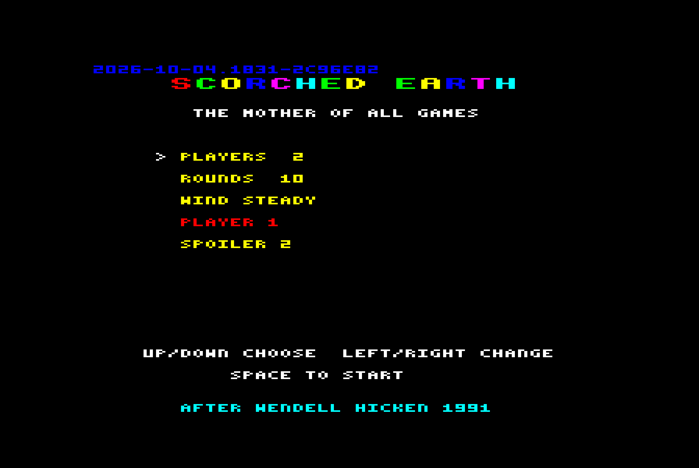
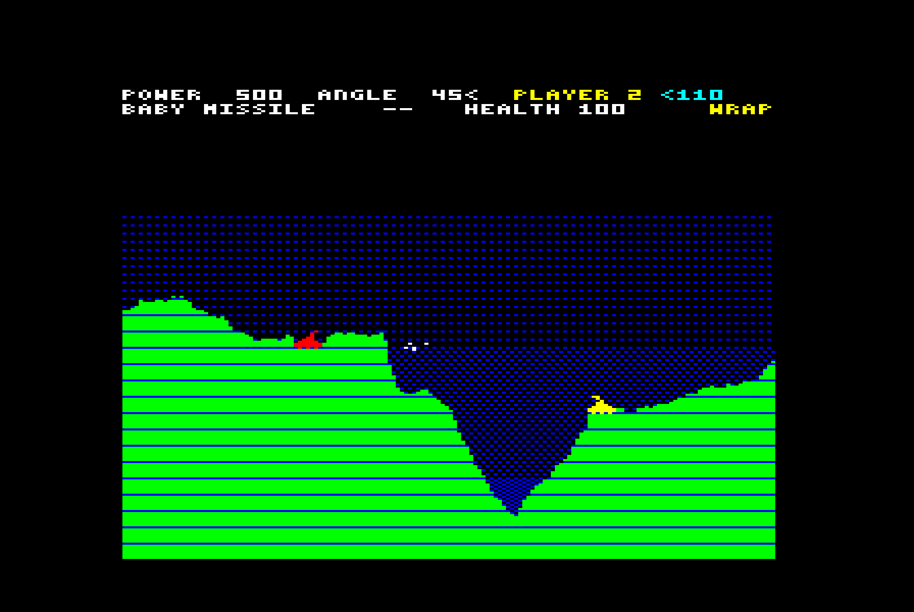
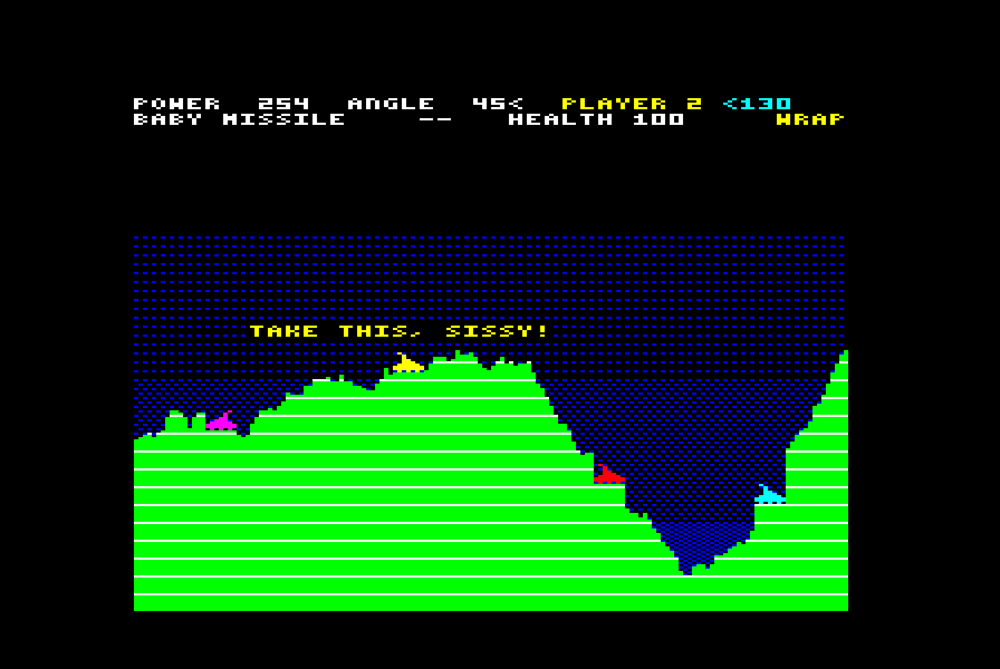
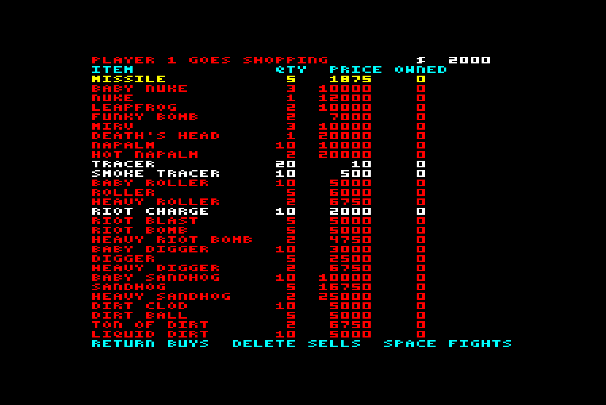

# SCORCHED EARTH for the BBC Micro

A port-in-spirit of Wendell Hicken's *Scorched Earth* ("The Mother of All
Games", PC shareware, 1991) to a 32K BBC Model B with a disc drive, in 6502
assembly.

### ▶ [**Play it in your browser**](https://bbc.xania.org/?disc=https://raw.githubusercontent.com/mattgodbolt/beeb-scorched-earth/main/scorched-earth.ssd&autoboot)

That link hands [jsbeeb](https://github.com/mattgodbolt/jsbeeb) the disc
image straight from this repository and boots it on a BBC B.





Two to six tanks on a random landscape. Take turns to set your turret's
angle and power, allow for the wind, and fire. Dirt falls, tanks fall,
tanks die, and the last one standing wins the round. Spend your winnings
in the shop between rounds on bigger and sillier weapons.

## Playing it

[Play it in your browser](https://bbc.xania.org/?disc=https://raw.githubusercontent.com/mattgodbolt/beeb-scorched-earth/main/scorched-earth.ssd&autoboot),
or put [`scorched-earth.ssd`](scorched-earth.ssd) in any BBC Micro emulator
(or on a real disc) and SHIFT+BREAK. To start it by hand, type `MODE 2`
then `*RUN SCORCH`: the game must be loaded in MODE 2 (see "How it works").

### Setup

UP/DOWN choose a line, LEFT/RIGHT change it: the number of players
(2-6), the number of rounds (1-99), and who each player is - a human, or
one of the original's computer personalities:

| | |
|---|---|
| **Moron** | fires at random |
| **Shooter** | one steep angle, rough power |
| **Tosser** | wild at first, but improves with every shot |
| **Spoiler** | tries four angles, including a high lob, and aims well |
| **Cyborg** | aims better still, and picks on the weakest tank |

SPACE starts.

### Your turn

| Key | Does |
|---|---|
| LEFT / RIGHT | turn the turret |
| UP / DOWN | power (hold to speed up, SHIFT for single steps) |
| TAB | next weapon you own |
| SPACE or RETURN | fire |
| B | use a Battery: +10 health |
| S | raise a Shield |
| ESCAPE | give up the game |

As in the original, **your maximum power is ten times your health**: a
battered tank can't fire as far. The status bar shows power, angle (0-90
from the horizontal, with an arrow for the side you face), whose turn it
is, the wind, your weapon and how many are left, your health, and this
round's walls:

| Walls | |
|---|---|
| OPEN | shots fly off the sides and are lost |
| WRAP | the left and right edges join |
| RUBBER | shots bounce |
| CONCRETE | shots burst on the walls |



### The shop

Everyone starts with nothing but unlimited Baby Missiles. Damage earns
$50 a point, a kill $2,500, winning a round $10,000; everyone is paid
$2,000 a round, and money in the bank earns about 5%. Prices and bundle
sizes are the original's. Items you can't afford are shown in red.

| Weapon | |
|---|---|
| Baby Missile, Missile, Baby Nuke, Nuke | bigger and bigger bangs |
| Leapfrog | bursts, and hops on twice more |
| Funky Bomb | bursts and scatters six bomblets |
| MIRV | splits into five at the top of its arc |
| Death's Head | splits into nine big ones |
| Tracer | does nothing, but leaves its path drawn |
| Baby Roller, Roller, Heavy Roller | roll downhill into a valley, or a tank |
| Riot Bomb, Heavy Riot Bomb | blow away dirt, hurt nobody |
| Dirt Clod, Dirt Ball, Ton of Dirt | bury people |
| Parachute | opens by itself when you fall far enough to hurt |
| Battery | +10 health (press B) |
| Shield | soaks up 60 points of damage (press S) |



Once every human is dead, the computers finish the round at full speed.
A round still going after 50 turns is a draw.

Computer players talk, as they did in the original: lines from its
TALK1.CFG when they fire and TALK2.CFG when anyone dies.

## What was left out

Scorched Earth is a big game; a 32K machine with 20K of screen gets the
heart of it. Gone: diggers, sandhogs, napalm, lasers and plasma (the
terrain is a heightmap, so nothing can tunnel - see DESIGN.md), guidance
systems, fuel and tank movement, simultaneous play, teams, and the
original's dozens of options. Turned on and fixed: falling dirt, falling
tanks, random walls, random wind.

## Building

Needs [baron](https://github.com/waitingforvsync/baron), Rich
Talbot-Watkins' successor to BeebAsm. The Makefile looks for it at
`../baron/build/src/baron`:

```sh
git clone --recurse-submodules https://github.com/waitingforvsync/baron ../baron
cmake -S ../baron -B ../baron/build -G Ninja -DCMAKE_BUILD_TYPE=Release
cmake --build ../baron/build
make            # -> build/scorch.ssd
make ship       # -> scorched-earth.ssd, the disc the play link uses
```

## Testing

The game is developed against a headless BBC Micro, driven through the
[jsbeeb MCP server](https://www.npmjs.com/package/jsbeeb-mcp):

```sh
npm install     # the MCP client SDK
make run        # boot it, screenshot to shots/run.png
make test       # four computer players fight a 3-round game; fails on a crash
```

`tools/play.mjs` runs scripted key presses with screenshots, screen dumps,
pokes and peeks by symbol name (from baron's `--symbols` JSON). `tools/`
also has a screen-dump renderer and a screenshot tiler. `journal.md` is
the running log of what was learned along the way.

## How it works

- **MODE 2, cut short.** 160x232, eight colours. Scorched Earth is about
  colour: a colour per player, and explosions that glow by cycling
  logical colours 8-15 through hot palettes (one `&FE21` write recolours
  every pixel of a colour, so it costs nothing per pixel). The screen is
  29 character rows instead of 32, which buys the code nearly 2K.
- **Its own 3x5 font**, so text runs to 40 columns. The glyphs are ASCII
  art in the source, turned into bits by a baron `FUNCTION`.
- **The landscape is a heightmap**: one number per column for where the
  dirt starts. That is faithful, not just cheap: the original's default
  is for dirt to always settle. A crater lifts the surface, or leaves a
  block of dirt in mid-air that then drops by the height of the hole - two
  pixels a column a step, so you see it fall. Sky and dirt colours are
  per-row tables, so a dithered sky or striped strata cost nothing, and
  anything can be repainted from the model: there are no save-under
  buffers anywhere.
- **Ballistics** are 16.16 fixed point, eight substeps a frame, with
  horizontal speeds halved because MODE 2 pixels are twice as wide as they
  are tall. Up to nine shells fly at once (MIRVs, Funky Bomb bomblets,
  leapfrog hops), each a 16-byte record copied into zero page to be moved.
- **The computer players aim like the Atari 8-bit Scorch**: they fire
  invisible test shots through the same ballistics code and binary-search
  the power, so wind, walls and hills are allowed for without a single
  special case. Then each personality spoils its own aim by a different
  amount.
- **The zero page belongs to baron's allocator**: routines declare their
  variables by name and baron packs them, proving the packing safe.

## Credits

Scorched Earth is by Wendell Hicken. The weapon prices, the talk lines and
the computer personalities are his. This is a fan port, written with
Claude Code; see `journal.md` for how it went.
